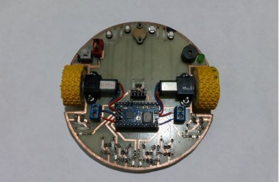
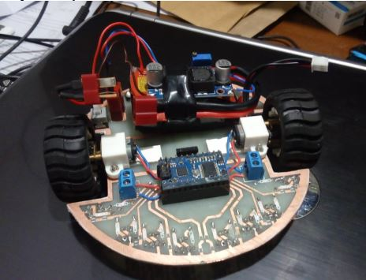
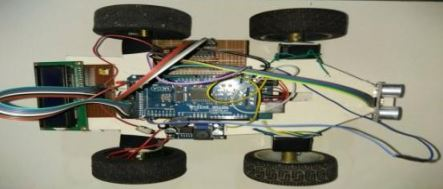

<html lang="en">
	<head>
<!-- 		<link href="https://maxcdn.bootstrapcdn.com/bootstrap/3.3.7/css/bootstrap.min.css" rel="stylesheet"/>
    
     -->
		
	</head>
	<body style="margin: 0; padding: 0; font-family: sans-serif;">
		

			<!-- -->
			<a href="../files/projects/p11.html" target="_blank">
						

				

				  
				

				

				  <!-- Technology -->
				  <h4 align="center">
				    Maze Solver Robot
				  </h4>
				

			

			</a>
				<!--  --> 
				<a href="../files/projects/p12.html" target="_blank">
			

				

				  
				

				

				  <!-- Popular -->
				  <h4 align="center">
				    Line Follower Robot
				  </h4>
				

			

			</a>
			<!--  -->
			<a href="../files/projects/p14.html" target="_blank">
						

				

				  
				

				

				  <!-- Technology -->
				  <h4 align="center">
				    Accident Detection and Prevention System
				  </h4>
				

			

			</a>
	</body>

</html>

